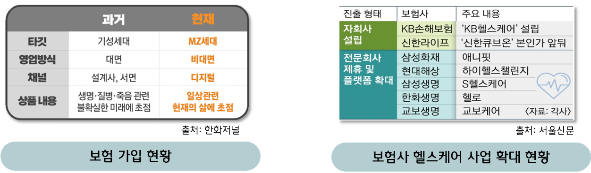
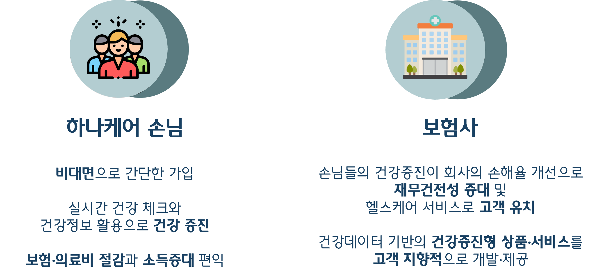
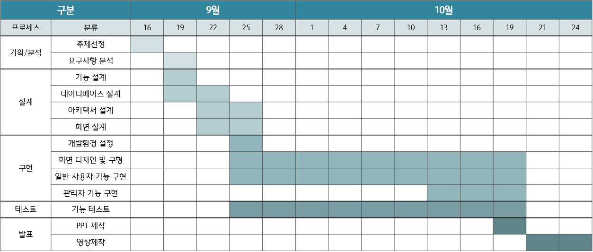
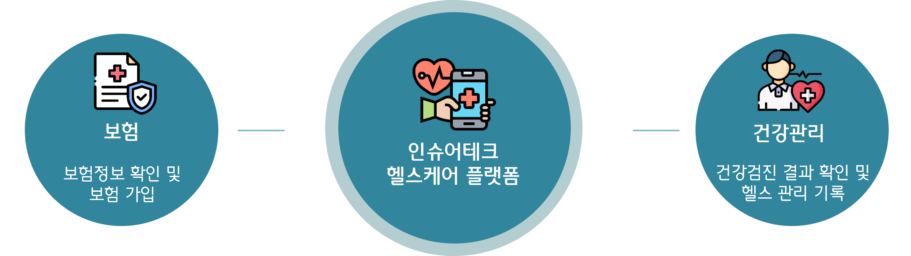
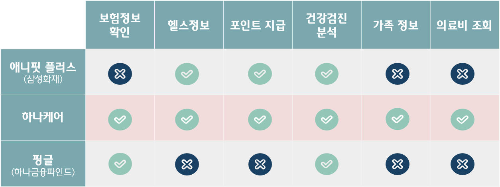
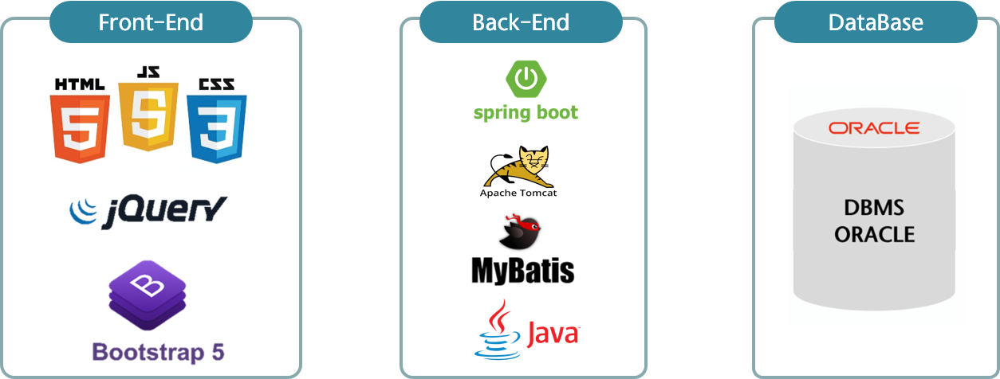
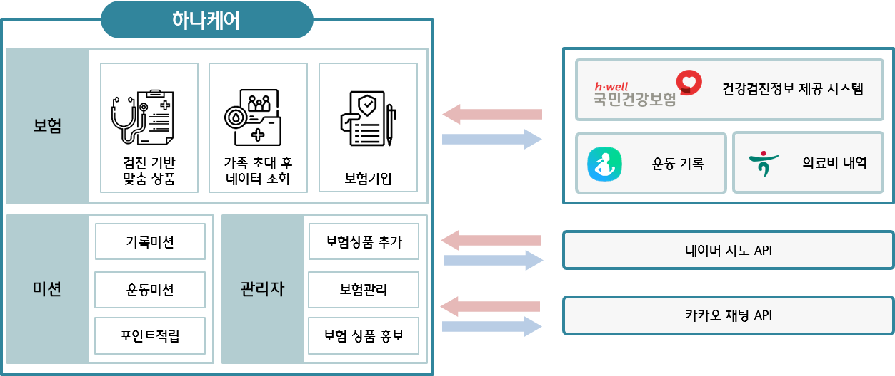
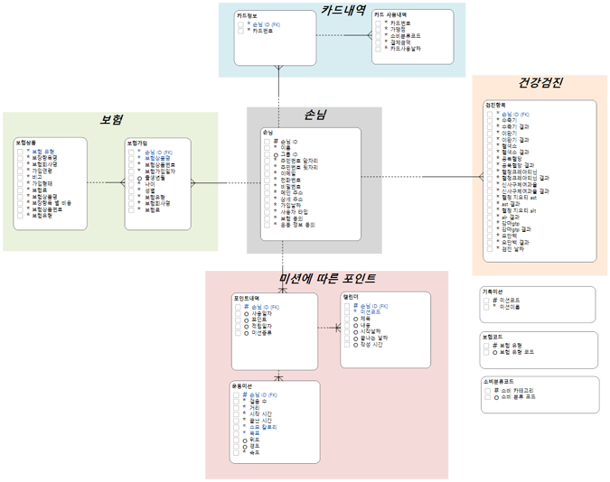
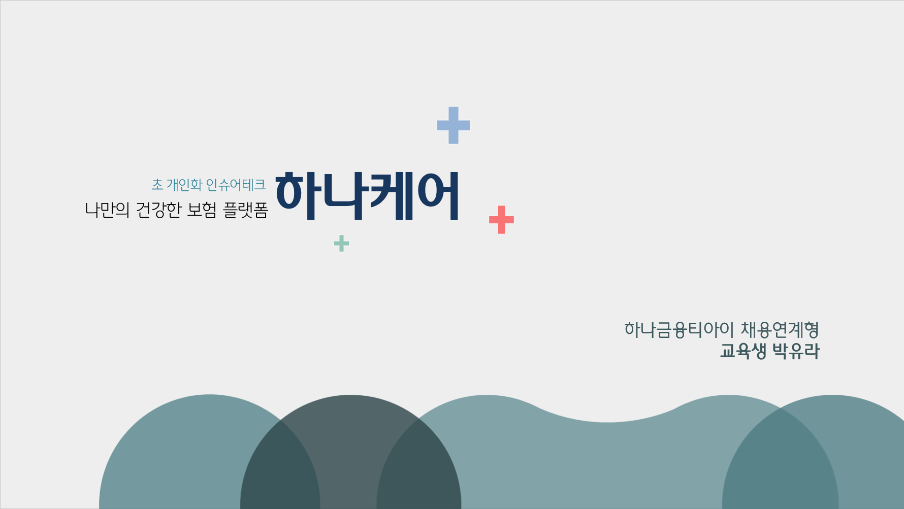

# 하나케어 - 초 개인화 인슈어테크, 나만의 건강한 보험 플랫폼

[프로젝트 홈페이지](https://koposoftware.github.io/2022_5_yrpark/)

# 1. 프로젝트 소개
### 1-1. 프로젝트 배경
• 최근 아픈 뒤 비싼 병원비를 쓰기보다 아프기 전에 몸 관리를 철저히 하자는 분위기로 변화되면서 현재 MZ세대들은 비대면, 디지털로 일상관련 보험을 많이 들고 있음<br>
• 고령화·저출산·저성장 등 3중고를 겪고 있는 보험사들은 헬스케어 사업을 신성장 동력으로 낙점하여 사업을 확대하고 있음<br>
• 이를 바탕으로 디지털, 모바일을 활용한 실시간 건강정보와 관리프로그램, 고객 생활 전반에 친근하게 이용할 수 있는 서비스 제공<br>


### 1-2. 프로젝트 기대효과


### 1-3. 개발환경
```
- OS : window 10
- Framework : Spring Boot
- Server : tomcat9
- Tool : Eclipse, Sql Developer, Github
- DBMS : Oracle DBMS
```

### 1-4. 수행기간
개발기간: 2022.09.16 - 2022.10.24



# 2. 프로젝트 제안서

[프로젝트 제안서](/proposal.pdf)<br>
### 2-1. 프로젝트 개요
• 보험사를 이용하는 모든 고객들이 비대면으로 보험 정보를 쉽게 확인<br>
• 보험가입에 대한 접근성을 높임과 동시에 사전에 질병을 예방하고 관리할 수 있음<br>


### 2-2. 타사기능비교


### 2-3. 프로젝트 아키텍처


### 2-4. 핵심기능


### 2-5. 적용기술
• Spring 기반 웹 페이지 제작<br>
• Spring Scheduler, CoolSMS를 이용한 일정 시간에 문자 전송<br>
• FullCalendar 라이브러리를 활용한 캘린더 구현<br>
• jsPDF, html2canvas를 이용한 pdf 다운로드<br>
• Java Mail Saender를 이용한 메일 송부<br>
• API : Kakao Message, Naver Map <br>

# 3. 프로젝트 결과
### 3-1. 서비스 아키텍처


### 3-2. ERD

   <br>
## 발표 ppt 

[발표자료](/project.pdf)<br>
## 시연 동영상 

  <iframe width="424" height="238" src="https://www.youtube.com/embed/jZsJe_0oqxs" title="웹개발프로젝트_하나케어_시연영상" frameborder="0" allow="accelerometer; autoplay; clipboard-write; encrypted-media; gyroscope; picture-in-picture" allowfullscreen></iframe>

# 4. 본인 소개

|구분|내용|비고|
|---|---|---|
|이름|박유라||
|연락처|yrpr1014@gmail.com||
|Frontend skill|HTML, CSS, Javascript||
|Backend skill|Java, Spring, Oracle||
|자격증| 데이터분석준전문가(ADsP) | 2021.12 |
|| SQL개발자 (SQLD자격) | 2022.06 |
|| 정보처리기사(필기) | 2022.08 |
|대외활동|한이음 ‘금융약자 청소년 대상 마이데이터를 활용한 공모주 주가변동 AI 예측 플랫폼’ 선정|2022년 03월 ~ 2022년 11월|
|교육활동|하나금융티아이 채용전환형 교육 1200시간( 한국폴리텍대학교 광명융합기술교육원 - 데이터분석과 )|2022년 03월 ~ 2022년 10월|
|경력| 주식회사 드웰링 | 2019년 02월 ~ 2021년 07월 |
