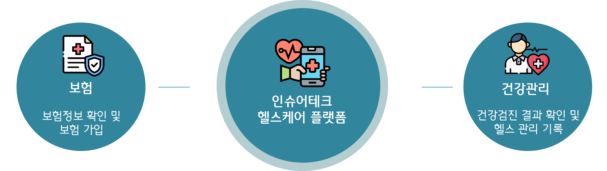
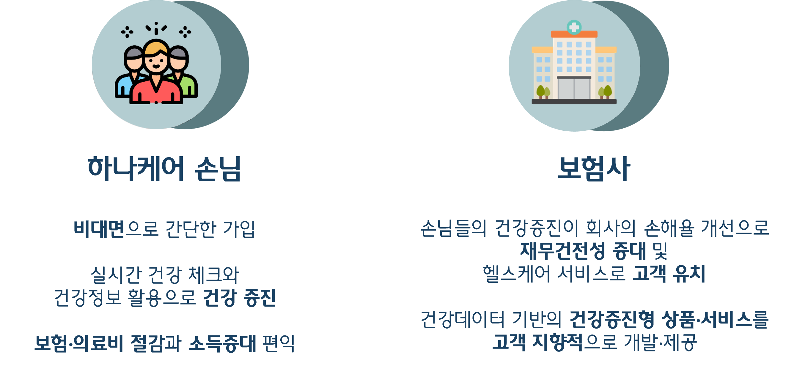
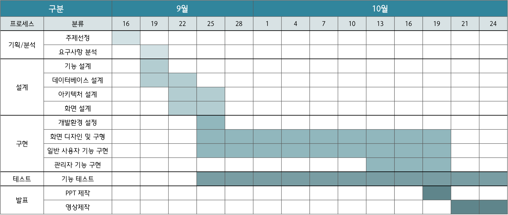
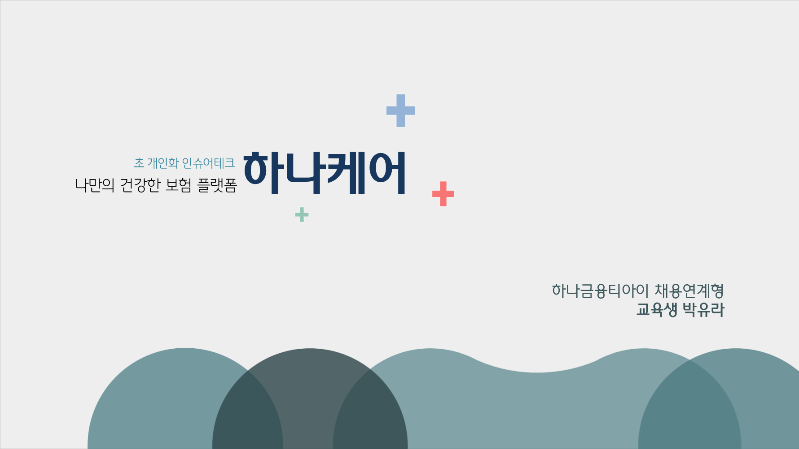

# 하나케어 - 초 개인화 인슈어테크, 나만의 건강한 보험 플랫폼

[프로젝트 홈페이지](https://koposoftware.github.io/2022_5_yrpark/)

# 1. 프로젝트 소개
### 1-1. 프로젝트 개요
• 보험사를 이용하는 모든 고객들이 비대면으로 보험 정보를 쉽게 확인
• 보험가입에 대한 접근성을 높임과 동시에 사전에 질병을 예방하고 관리할 수 있음

### 1-2. 프로젝트 기대효과

### 1-3. 개발환경
- OS : window
- Framework : Spring Boot
- Server : tomcat9
- Tool : Eclipse, Sql Developer, Github
- DBMS : Oracle DBMS

### 1-4. 수행기간

# 2. 프로젝트 제안서

[발표자료](/project.pptx) 
    
  <iframe width="424" height="238" src="https://www.youtube.com/embed/reOGfxYJre0" title="YouTube video player" frameborder="0" allow="accelerometer; autoplay; clipboard-write; encrypted-media; gyroscope; picture-in-picture" allowfullscreen></iframe>

# 3. 프로젝트 결과
프로젝트 결과를 추가하세요. 발표자료. 시연동영상을 추가하세요.
    
   
    
## 발표 ppt 

[발표자료](/project.pptx) 
## 시연 동영상 

  <iframe width="424" height="238" src="https://www.youtube.com/embed/reOGfxYJre0" title="YouTube video player" frameborder="0" allow="accelerometer; autoplay; clipboard-write; encrypted-media; gyroscope; picture-in-picture" allowfullscreen></iframe>

# 4. 기타
그외 프로젝트를 더욱 설명할수 있는 것들을 추가하세요
 
# 5. 본인 소개

본인 소개를 추가하세요

|이름 |박유라||
|연락처 | yrpr1014(@)gmail.com|
|skill set| Frontend - HTML, CSS, Javascript|
| | Backend - Java, Spring, Oracle|
|자격증| 2022년 정보처리기사 |
|| 2022년 SQLD |
|| 2021년 ADsP |
|수상| 20xx년 ICT 멘토링 프로젝트 대상 수상 (과학기술정보통신부 지원)  |
| | 20xx년 한국폴리텍대학 벤처창업아이템경진대회 대상 수상 (고용노동부 후원)  |
| | 20xx년 금융데이터경진대회 금상 수상|
| | 20xx년 대학생 논문 경진대회 은상 수상|
|경력|  TOEIC 990 |
||  리니지 만랩 |

